# Session 21: Final DevOps Project

Student: Nishant Dasgupta  
Roll number: **24bcs10451**

## Overview and architecture

TaskBoard uses the supplied React frontend, FastAPI backend, and PostgreSQL database. Technologies: GitHub Actions, Docker/GHCR, Kubernetes, Helm, Terraform/AWS, Prometheus/Grafana, and Argo CD.

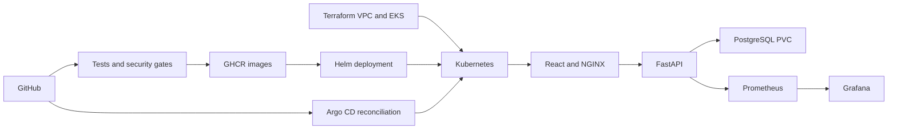

## Application and Docker

Run from the repository root:

```bash
docker compose up -d --build
```

Compose UI: http://localhost:3000. API docs: http://localhost:8000/docs. Three backend tests passed; task creation and database readiness were verified.

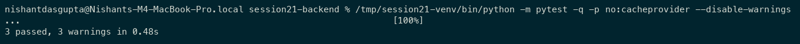

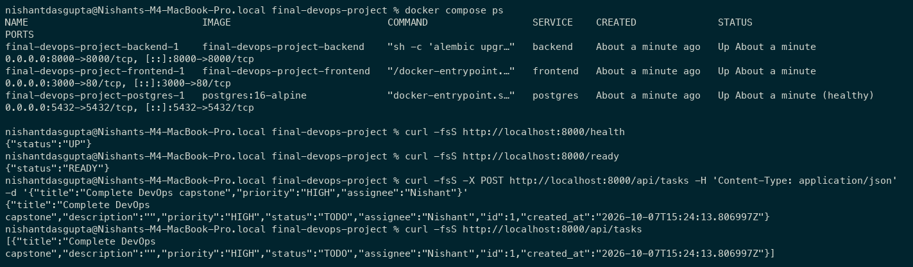

## Kubernetes and Helm

The local Minikube release includes frontend/backend Deployments, Services, ConfigMap, Secret, Ingress, CPU HPA, liveness/readiness probes, and a PostgreSQL PVC.

```bash
minikube image load final-devops-project-backend:latest
minikube image load final-devops-project-frontend:latest
helm upgrade --install taskboard ./helm/taskboard --kube-context minikube -n taskboard --create-namespace \
  --set backend.image=final-devops-project-backend --set backend.tag=latest \
  --set frontend.image=final-devops-project-frontend --set frontend.tag=latest \
  --set ingress.enabled=true --set monitoring.serviceMonitor.enabled=false --wait
kubectl --context minikube get pods,svc,ingress,hpa,pvc -n taskboard
```

Enable ServiceMonitor after installing the monitoring stack. Browser forwards: Helm UI http://localhost:3002; Helm API docs http://localhost:8001/docs.

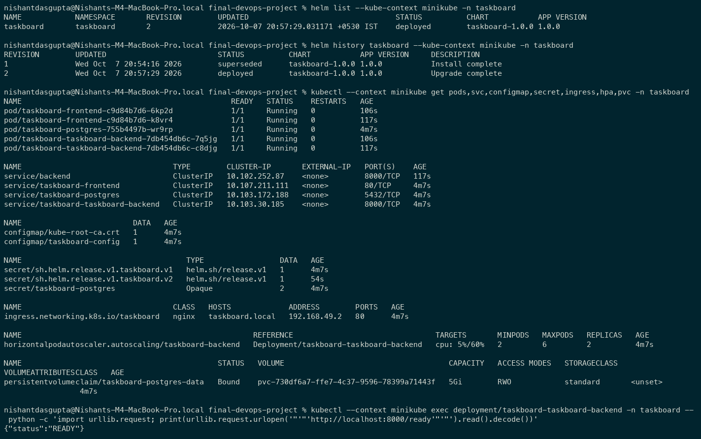

## CI/CD and DevSecOps

[Repository](https://github.com/NDGCodes/session20-gitops-demo), reusing 19's repository while preserving its `app/` folder. [Workflow](.github/workflows/ci-cd.yml): tests/frontend build, CodeQL, pip-audit/npm audit, source secret scan, Docker build, strict Trivy scan, GHCR push, and Helm deployment into a temporary CI kind cluster.

The image gate blocks **all HIGH/CRITICAL findings**, including unfixed ones. Updated backend/monitoring/test dependencies and Alpine runtime packages passed the local scans.

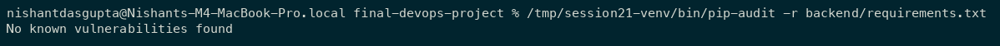

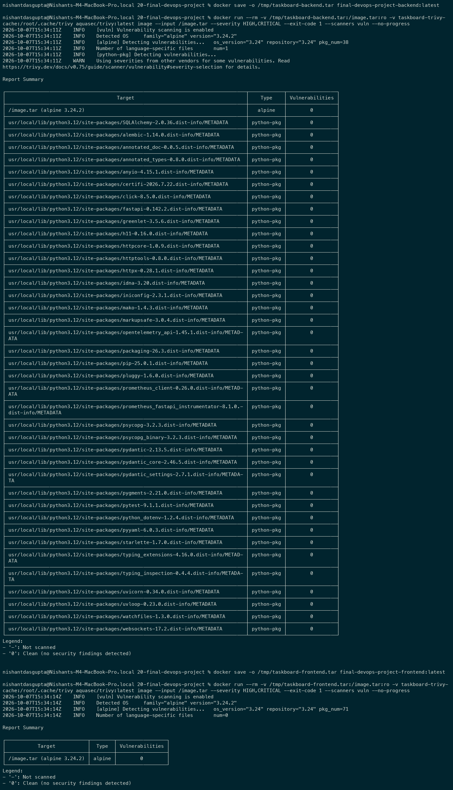

[Successful CI/CD run](https://github.com/NDGCodes/session20-gitops-demo/actions/runs/37645074586): tests, SAST, SCA, secrets, strict image scans, GHCR publishing, and Helm deployment passed.

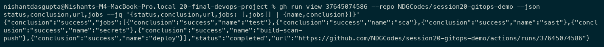

## Monitoring

```bash
helm repo add prometheus-community https://prometheus-community.github.io/helm-charts
helm upgrade --install kube-prometheus-stack prometheus-community/kube-prometheus-stack --kube-context minikube \
  -n monitoring --create-namespace -f monitoring/prometheus-values.yaml \
  --set alertmanager.enabled=false --set defaultRules.create=false --wait
helm upgrade taskboard ./helm/taskboard --kube-context minikube -n taskboard --reuse-values --set monitoring.serviceMonitor.enabled=true
```

Prometheus scraped both backend replicas and recorded HTTP requests. Grafana dashboard: http://localhost:3001/d/taskboard-final/taskboard-final-project. Prometheus: http://localhost:9091.

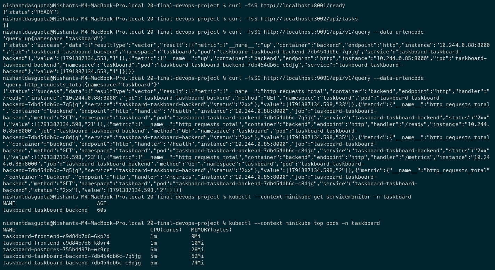

## GitOps

[Argo CD Application](gitops/application.yaml) watches `helm/taskboard` in Git. The kind demo uses matching locally built ARM images tagged with the source revision; CI publishes runner-platform images to GHCR. Dev values use one replica, with Ingress/ServiceMonitor disabled in this separate demo cluster.

Argo CD reported **Synced / Healthy**. Scaling the backend to two replicas was automatically reconciled back to the one replica declared in Git.

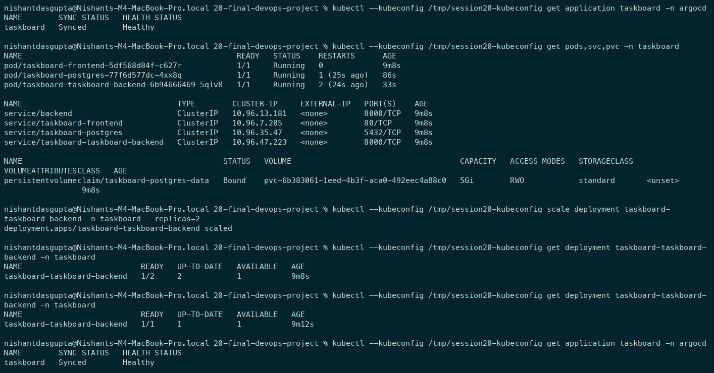

## Terraform infrastructure

[CloudShell walkthrough](terraform/README.md). Configuration initialization and validation passed locally. **AWS apply, EKS resource evidence, and destroy are pending your run.** EKS, NAT, and worker nodes incur charges.

## Troubleshooting

| Issue | Investigation and cause | Fix and verification |
| --- | --- | --- |
| Broken image | Supplied manifest references a nonexistent registry image/tag; inspected workload events. | Used the built backend image, correct pull policy, and database environment; rollout succeeded. |
| Broken Service | Selector matched no pods; endpoints were empty. Target port also differed from the backend. | Set selector to `taskboard-backend` and target port 8000; endpoints appeared and health returned UP. |

Both deliberately broken resources were removed after verification.

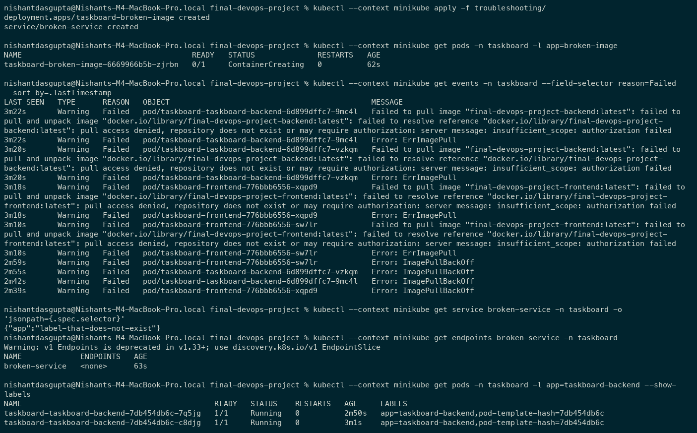

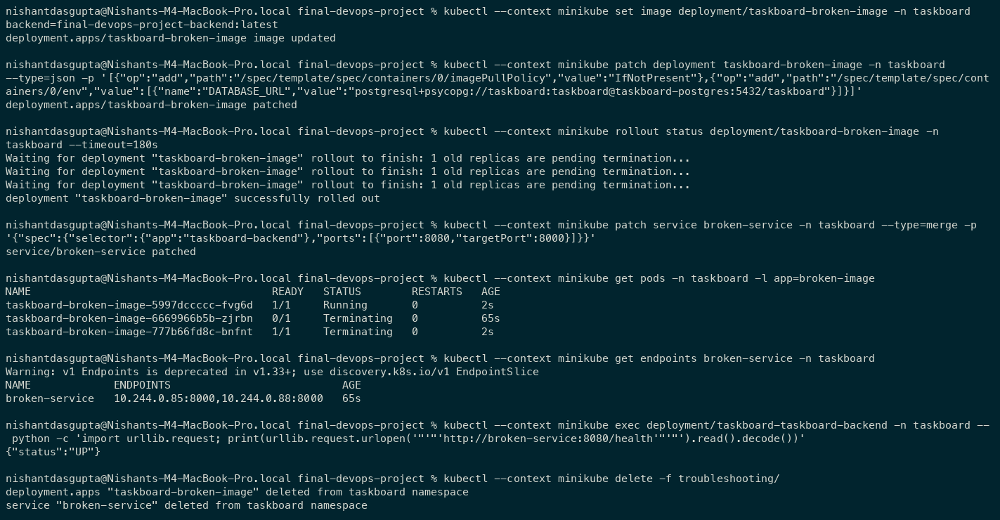

## Source fixes and lessons

Application source is unchanged. Required supporting fixes: test-client lifespan, database startup ordering, valid Terraform syntax/current EKS version, ConfigMap, backend Service alias, local image pull policy, valid Trivy action, patched dependencies/runtime images, and missing security/GitOps configuration.

The GitOps demo also hit Docker Hub rate limiting; loading the existing PostgreSQL image resolved it. Concurrent initial migrations required resetting the empty demo schema before restarting.

Lessons: startup ordering matters; Service names and selectors must match consumers; image tags and pull policies affect deployment; security gates must pass before publishing; GitOps reconciles desired state, while Terraform manages cloud infrastructure.

## Remaining evidence

- TaskBoard UI with a created task and FastAPI docs.
- Grafana TaskBoard dashboard and Prometheus targets.
- Argo CD `taskboard` application.
- Successful final CI run and GHCR images.
- AWS Terraform workflow, EKS/network resources, and destroy.
